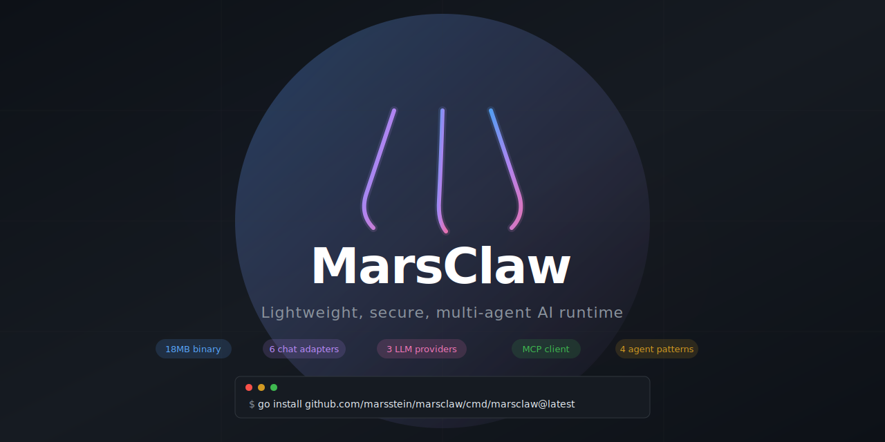

<p align="center">
  
</p>

<p align="center">
  <a href="#quick-start">Quick Start</a> ·
  <a href="#features">Features</a> ·
  <a href="#comparison">Comparison</a> ·
  <a href="#configuration">Configuration</a> ·
  <a href="#architecture">Architecture</a> ·
  <a href="#roadmap">Roadmap</a>
</p>

---

**18MB binary · <50MB RAM · Sub-second startup · Zero CVEs**

MarsClaw is a personal AI agent runtime written in Go. It connects to Claude, GPT, and local models to help you code, automate tasks, and orchestrate multi-agent workflows — all from a single binary with no dependencies.

```
$ marsclaw "add error handling to main.go"

⚡ read_file
✓ read_file
⚡ edit_file
✓ edit_file

Added error wrapping with fmt.Errorf to all three return paths in main().

── claude-sonnet-4 │ 1.2K in / 523 out │ $0.012 session ──
```

## Quick Start

```bash
# Install
go install github.com/marsstein/marsclaw/cmd/marsclaw@latest

# Or download a binary
curl -sSfL https://marsclaw.dev/install.sh | sh

# Set your API key
export ANTHROPIC_API_KEY="sk-ant-..."

# Interactive mode
marsclaw

# Single prompt
marsclaw "explain this codebase"

# Web UI (access from any device)
marsclaw serve --addr :8080

# Telegram bot
export TELEGRAM_BOT_TOKEN="..."
marsclaw telegram

# Use with OpenAI
export OPENAI_API_KEY="sk-..."
marsclaw -m gpt-4o "explain this code"

# Use with local Ollama (free, offline)
marsclaw -m llama3.1 "explain this code"

# Discord bot
export DISCORD_BOT_TOKEN="..."
marsclaw discord

# Slack bot
export SLACK_BOT_TOKEN="xoxb-..."
marsclaw slack
```

## Comparison

|  | OpenClaw | PicoClaw | ZeroClaw | **MarsClaw** |
|---|---------|----------|----------|:------------:|
| **Language** | TypeScript | Go | Rust | **Go** |
| **Binary** | npm install | 8MB | 3.4MB | **18MB** |
| **Memory** | 200MB+ | <20MB | <15MB | **<50MB** |
| **Startup** | 3-5s | <100ms | <50ms | **<200ms** |
| **CVEs** | 512+ | 0 | 0 | **0** |
| **LOC** | 430K | ~15K | ~10K | **~6.5K** |
| **Multi-agent** | No | No | No | **4 patterns** |
| **Providers** | Anthropic | Anthropic | Anthropic | **3 (Anthropic/OpenAI/Ollama)** |
| **Web UI** | Yes | No | No | **Built-in** |
| **Chat adapters** | No | No | No | **6 (CLI/Web/Telegram/Discord/Slack/WhatsApp)** |
| **MCP client** | No | No | No | **Built-in** |
| **Scheduled tasks** | No | No | No | **Cron + intervals** |
| **Persistent memory** | No | No | No | **SQLite-backed** |
| **Session persistence** | No | No | No | **SQLite** |
| **Cost tracking** | No | No | No | **Built-in** |
| **Credential scanning** | No | No | No | **Yes** |
| **Tool approval** | No | Partial | No | **Per-danger-level** |
| **Offline mode** | No | No | No | **Yes (Ollama)** |

## Features

### Agent Loop

A flat while-loop — the same pattern powering Claude Code. No state machines, no graph orchestration:

```
for each turn (max 25):
    1. Build context (SOUL.md + memory + trimmed history)
    2. Call LLM (with retry + streaming)
    3. Check token budget
    4. Route: text → done | tool calls → execute → loop
```

Every step traced. Every error fed back to the model for self-correction. Never crashes on bad tool calls.

### Built-in Tools

| Tool | Description | Danger Level |
|------|-------------|:------------:|
| `read_file` | Read files with line numbers | Safe |
| `write_file` | Create/overwrite files | Medium |
| `edit_file` | Surgical string replacement | Medium |
| `shell` | Execute shell commands | High |
| `list_files` | Directory listing with glob | Safe |
| `search` | Regex search across files | Safe |
| `git` | Read-only git (status, log, diff, blame) | Safe |

### Multi-Agent Orchestration

Four production-ready patterns — **no other lightweight alternative has any**:

| Pattern | Description |
|---------|-------------|
| **Supervisor** | Coordinator delegates to specialist agents via tool calling |
| **Pipeline** | Agent A → Agent B → Agent C, each transforms the output |
| **Parallel** | Fan-out to N agents concurrently, aggregate results |
| **Debate** | Multiple agents argue positions across rounds, judge synthesizes |

Each sub-agent runs its own loop with isolated history, tools, and safety checks.

### Six Ways to Access

| Mode | Command | Use Case |
|------|---------|----------|
| **CLI** | `marsclaw "prompt"` | Terminal power users |
| **Web UI** | `marsclaw serve` | Any browser, any device, phone at night |
| **Telegram** | `marsclaw telegram` | Chat from your phone, no browser needed |
| **Discord** | `marsclaw discord` | Team channels, community support |
| **Slack** | `marsclaw slack` | Workspace integration |
| **WhatsApp** | via `marsclaw serve` | Webhook at `/webhook/whatsapp` |

### MCP Client (Model Context Protocol)

Connect to any MCP-compatible tool server. MarsClaw discovers tools automatically:

```yaml
mcp:
  - name: filesystem
    command: npx
    args: ["-y", "@modelcontextprotocol/server-filesystem", "/home/user"]
  - name: github
    command: npx
    args: ["-y", "@modelcontextprotocol/server-github"]
    env: ["GITHUB_TOKEN=ghp_..."]
```

### Scheduled Tasks

Run agent tasks on a schedule — cron syntax or simple intervals:

```yaml
scheduler:
  tasks:
    - name: daily-summary
      schedule: "0 9 * * 1-5"
      prompt: "Summarize yesterday's git commits"
      channel: telegram:123456
      enabled: true
    - name: health-check
      schedule: "every 30m"
      prompt: "Check if the API is responding"
      channel: log
      enabled: true
```

### Persistent Memory

Cross-session knowledge that survives restarts. Three memory tiers:

| Tier | Purpose | Example |
|------|---------|---------|
| **Episodic** | Past events, summaries | "Yesterday we fixed the auth bug" |
| **Semantic** | Facts, preferences | "User prefers TypeScript" |
| **Procedural** | Workflows, patterns | "Deploy via: build → test → push" |

Memory is SQLite-backed and bounded per tier to prevent unbounded growth.

### Three LLM Providers

| Provider | Models | Cost |
|----------|--------|------|
| **Anthropic** | Claude Sonnet/Opus/Haiku | API key |
| **OpenAI** | GPT-4o, GPT-4o-mini | API key |
| **Ollama** | Llama, Mistral, Phi, any | Free, local, offline |

### Cost Tracking

Microdollar accounting (int64, no float drift):

```
── claude-sonnet-4 │ 1.2K in / 523 out │ $0.012 session ──
```

- Per-model pricing tables built in
- Daily/monthly budget enforcement
- Session and cumulative tracking

### Security

| Protection | How |
|------------|-----|
| **Default-deny tools** | Every tool has a `DangerLevel` — high-danger requires approval |
| **Path traversal guard** | All file paths validated against allowed directories |
| **Credential scanning** | Regex patterns catch API keys, passwords, private keys in all tool outputs |
| **JSON validation** | Tool arguments validated before execution |
| **Timeout enforcement** | LLM calls (120s) and tool calls (60s) have hard timeouts |

### Context Engineering

Following Anthropic's production guidelines:

```
┌─────────────────────────────────┐
│ System prompt: 25% of budget    │ ← SOUL.md + memory
├─────────────────────────────────┤
│ History: 65% of budget          │ ← Conversation + tool results
├─────────────────────────────────┤
│ Reserved for output: 10%        │ ← Model's response
└─────────────────────────────────┘
```

- **History trimming**: Keeps first message (anchor) + most recent. Drops middle.
- **Tool result truncation**: 70% head + 30% tail for large outputs.
- **180K token budget** by default (configurable).

## Configuration

```yaml
# ~/.marsclaw/config.yaml

providers:
  default: anthropic
  anthropic:
    api_key_env: ANTHROPIC_API_KEY
    default_model: claude-sonnet-4-20250514
  openai:
    api_key_env: OPENAI_API_KEY
    default_model: gpt-4o

agent:
  max_turns: 25
  max_input_tokens: 180000
  enable_streaming: true

cost:
  inline_display: true
  daily_budget: 10.00

security:
  scan_credentials: true
  path_traversal_guard: true
  allowed_dirs:
    - /home/user/projects

mcp:
  - name: filesystem
    command: npx
    args: ["-y", "@modelcontextprotocol/server-filesystem", "."]

scheduler:
  tasks:
    - name: standup
      schedule: "0 9 * * 1-5"
      prompt: "What changed in git since yesterday?"
      channel: log
      enabled: true

discord:
  token: ${DISCORD_BOT_TOKEN}

slack:
  bot_token: ${SLACK_BOT_TOKEN}

whatsapp:
  phone_number_id: "123456"
  access_token: ${WHATSAPP_ACCESS_TOKEN}
  verify_token: my-verify-token
```

All settings can be overridden with environment variables: `MARSCLAW_AGENT_MAX_TURNS=50`.

## Interactive Commands

```
/help      Show available commands
/clear     Clear conversation history
/history   Show message history
/quit      Exit MarsClaw
```

## Architecture

```
marsclaw/
├── cmd/marsclaw/           # CLI entrypoint (kong)
├── internal/
│   ├── agent/              # Agent loop, context builder, sub-agent orchestrator
│   ├── config/             # YAML config (koanf)
│   ├── llm/                # Provider abstraction (Anthropic, OpenAI, Ollama)
│   ├── orchestration/      # Multi-agent patterns (supervisor, pipeline, parallel, debate)
│   ├── security/           # Safety checker, credential scanner
│   ├── discord/            # Discord bot adapter
│   ├── mcp/                # MCP client (JSON-RPC 2.0 over stdio)
│   ├── memory/             # Persistent memory (3-tier, SQLite-backed)
│   ├── scheduler/          # Cron-like task scheduler
│   ├── server/             # HTTP server + embedded Web UI
│   ├── slack/              # Slack bot adapter
│   ├── store/              # SQLite session persistence
│   ├── telegram/           # Telegram bot adapter
│   ├── terminal/           # Interactive terminal UI
│   ├── setup/              # Interactive setup wizard
│   ├── tool/               # Built-in tools (read/write/edit/shell/search/git)
│   ├── types/              # Shared data structures
│   └── whatsapp/           # WhatsApp Cloud API adapter
├── Taskfile.yaml           # Build tasks
├── .goreleaser.yaml        # Cross-platform releases
└── .golangci.yml           # Linter config
```

**Dependency graph** (no cycles):

```
types ← security
types ← llm
types ← tool
types ← agent ← security (via interface)
types ← terminal ← agent
cmd/marsclaw ← all of the above
```

## Development

```bash
# Prerequisites: Go 1.23+, Task (go-task.dev)

# Build
task build

# Run tests
task test

# Lint (requires golangci-lint)
task lint

# All checks
task check

# Build snapshot release
task release:snapshot
```

## Roadmap

### Done

- [x] Core agent loop with streaming
- [x] Anthropic Claude provider
- [x] OpenAI provider (GPT-4o, GPT-4o-mini, any OpenAI-compatible API)
- [x] Ollama provider (local models, offline, free)
- [x] 6 built-in tools (read, write, edit, shell, list, search)
- [x] Interactive terminal mode
- [x] Web UI (single binary, access from any device)
- [x] Telegram bot adapter
- [x] Discord bot adapter
- [x] Slack bot adapter
- [x] WhatsApp Cloud API adapter
- [x] MCP client (connect to any MCP tool server)
- [x] Scheduled tasks (cron + interval syntax)
- [x] Persistent memory (3-tier, SQLite-backed)
- [x] Session persistence (SQLite)
- [x] Multi-agent patterns (supervisor, pipeline, parallel, debate)
- [x] Cost tracking (microdollar accounting)
- [x] Safety rails (credential scanning, path traversal, tool approval)
- [x] Context engineering (auto-trim, budget allocation)
- [x] Sub-agent orchestrator
- [x] SOUL.md / AGENTS.md auto-discovery
- [x] Git-aware tools (status, log, diff, blame)
- [x] Event hooks (pre/post tool, LLM, error)
- [x] Setup wizard (`marsclaw init`)

### Next

- [ ] VS Code extension
- [ ] Semantic memory search (embeddings)
- [ ] Agent-driven memory (remember/recall tools)
- [ ] Container sandbox for tool isolation

## License

Apache-2.0
